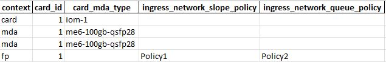

# Router_Config_Discovery

This script establishes a Netconf connection towards the SROS Router what support model-driven data model (YANG) and reads the card configs. Then puts all the necessary info to  an excel file.

